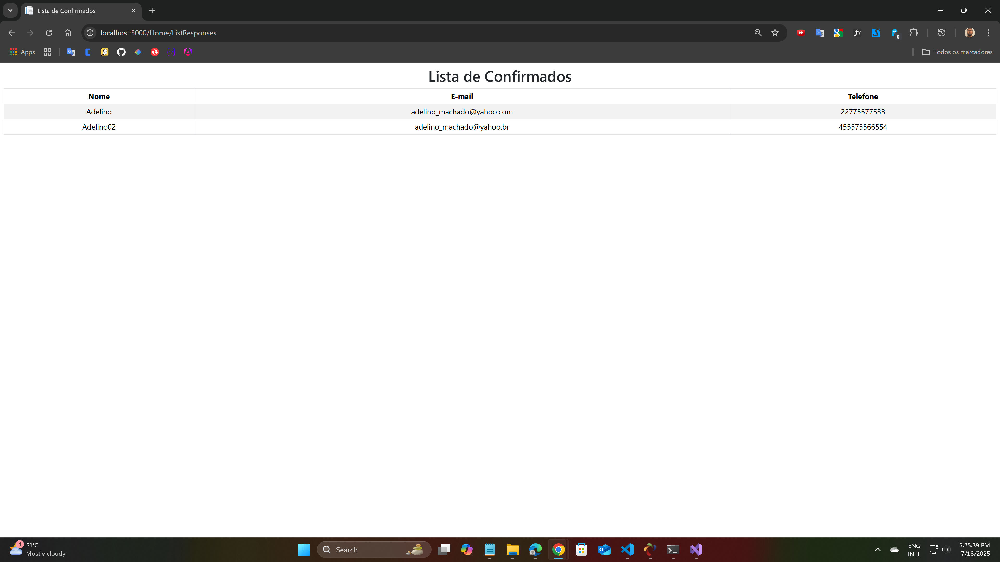

# ABM_04_ConviteFestas – Aplicativo Web para Confirmação de Presença (RSVP)

Aplicativo desenvolvido com foco em facilitar a confirmação de presença em eventos sociais, como festas, confraternizações ou encontros. Rápido, funcional e responsivo.

## Tecnologias Utilizadas

- C#
- ASP.NET Core 9
- HTML5
- CSS3
- JavaScript
- Bootstrap

## Funcionalidades

- Página inicial com convite e chamada para ação
- Formulário de confirmação de presença com validação
- Página de agradecimento personalizada
- Listagem dinâmica de convidados que confirmaram presença
- Interface responsiva para celulares, tablets e desktops

## Capturas de Tela _(sugestão de adicionar futuramente)_

## Como Executar o Projeto

### Pré-requisitos

- SDK .NET 9.0.203 instalado

Verifique com:

```bash
dotnet --version
```

### Executando

```bash
dotnet run
```

Acesse o app em `http://localhost:5000`.

### Fluxo de navegação

1. Página inicial
2. Formulário de RSVP
3. Página de agradecimento
4. Lista de confirmados

## Melhorias Futuras

- Sistema de autenticação de usuários
- Integração com banco de dados para persistência
- Upload de fotos para personalizar a festa
- Envio automático de e-mails de confirmação

## Estrutura do Projeto

- `Controllers/` – Lógica de controle (MVC)
- `Models/` – Modelos de dados com validação
- `Views/` – Páginas HTML dinâmicas via Razor
- `wwwroot/` – Arquivos estáticos e estilos

---

## Imagens ABM_04_ConviteFestas

- Pagina 01 - Home

  - 

- Pagina 02 - Formulário de RSVP

  - 

- Pagina 03 - Agradecimento

  - 

- Pagina 04 - Lista de Convidados Confirmados

  - 

---
